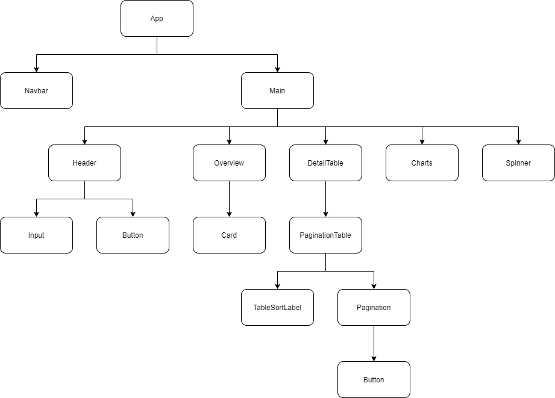

# Awesome Report

This application shows summary, daily report as well as data visualization with charts from given period of time.

## Features

- Fetch data from given start date, end date and access token.
- Store latest inputted dates and token after fetching successfully, and automatically fetch data with these values if user comes back to app later.
- Can remove all stored data if needed with `Clear` button.
- Show summary report in cards, daily report in table, and charts for both.
- Table is automaticaly paginated if data > 5 items, able to be sorted by all columns, default by date ascendingly.
- Notifications for error and successful fetching.
- Testing for almost all components.
- Fully responsive design for all devices.

## Getting Started

### Requirements

- Node version >= 10.16.0
- Internet connection for fetching data.

### Run the application

1. Clone the repository
2. Install the required packages with `yarn install` or `npm install`.
3. Start the dev server with `yarn start` or `npm start`.
4. Open any browser and enter `localhost:3000`.

### Testing

- Run test with `yarn test` or `npm test`.

## Technologies

- React.js
- Styled-components
- TypeScript
- Jest, Enzyme, React Testing Library
- Other libraries: axios, react-table, react-google-charts, toastr

## Component Structure

